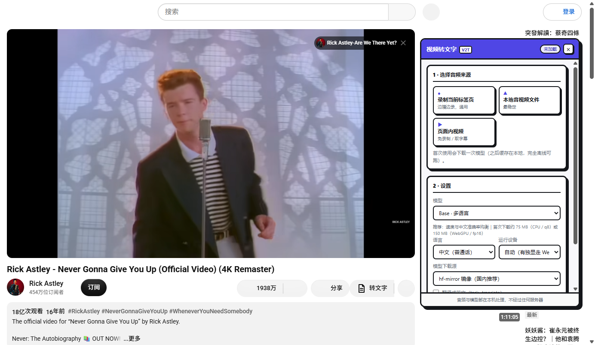
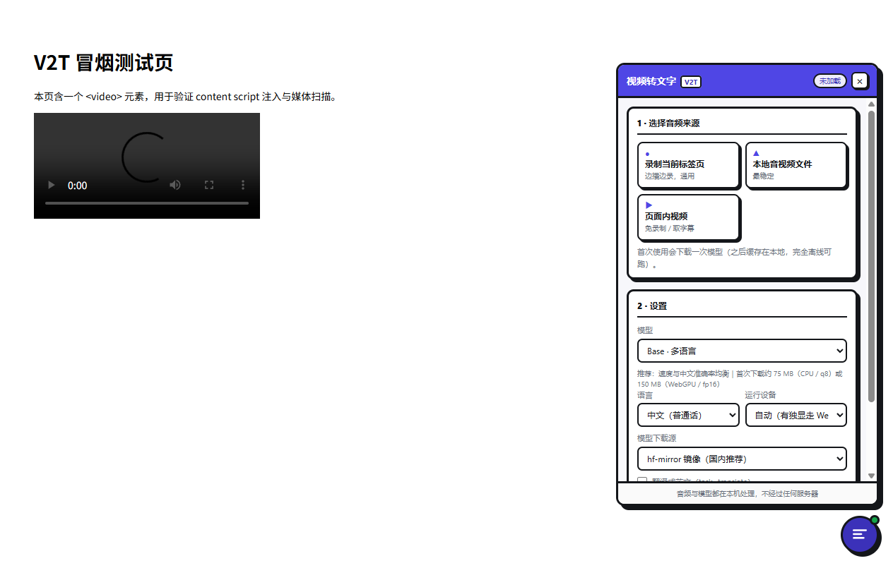
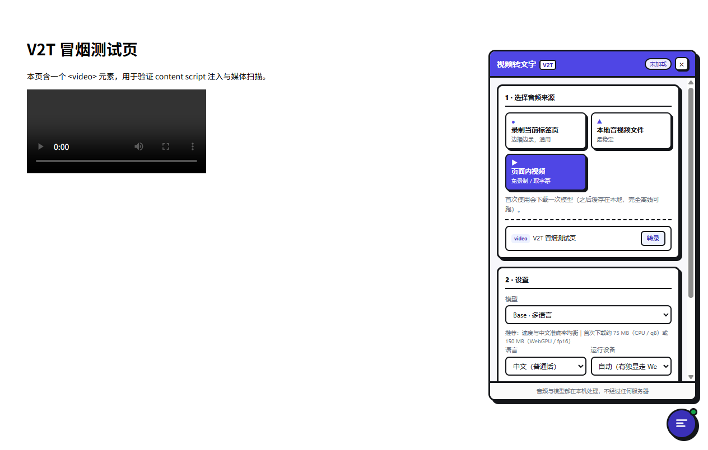

# 视频转文字助手 · 本地 AI

一个 Chrome MV3 插件：用 Whisper 在**浏览器本地**把视频 / 音频转成文字。
音频不出本机、不需要 API Key、**运行过程 0 调用成本**。

UI 与项目结构对标 [Bili-Mux（哔哩喵）](https://github.com/c-yyy/bili-mux) 的做法：
**无构建**（纯 JS 平铺根目录）、**页面内注入面板**、**Offscreen Document 干重活**。
入口优先插进站点自带的操作栏（YouTube 观看页等），没有可挂的地方才退回右下角悬浮按钮。

---

## 界面预览

在 YouTube 观看页，入口会**长在它自己的操作栏里**（「分享」右边），和原生按钮同款外观，
点了就地弹出面板 —— 不再往画面上浮一颗球：



其它站点没有这样的操作栏可挂，就退回右下角悬浮按钮 → 页内卡片面板：



选「页面内视频」会列出当前页里的媒体，可以挑一条直接转：



> 后两张由 `npm run smoke` 自动截取（页面是测试用的冒烟页）；
> 第一张由 `npm run yt` 在**真实的 YouTube 观看页**上截取。

---

## 入口是怎么插进别人页面里的

「在站点自带的操作栏里加一个按钮」听起来简单，实际有三个坑：

**1. 不要 cloneNode 原生按钮。**
最直觉的做法是复制一个现成的按钮再改图标和文字，但那些节点里是自定义元素
（`button-view-model` 之类）。克隆出来的副本一插进文档就会被 upgrade 并重新渲染，
把我们塞进去的内容冲掉，最后得到一个空按钮。

**2. 抄 class，而不是抄几份固定样式。**
改成「运行时从原生按钮上读 class 名，用普通 DOM 拼自己的按钮」——
这样配色、尺寸、圆角、暗色主题全都自动跟随站点，站点改版也不怕（class 是当场读的）。
代价是要挑对「捐赠者」按钮，见下一条。

**3. `#top-level-buttons-computed` 在真实 DOM 里出现 3 次，其中靠前的是空占位。**
YouTube 会把同一段元数据渲染好几份（模板残留），`document.querySelector` 恰好会命中
那个空壳，于是抄不到任何 class，只能退化成兜底样式。
正确做法是**只在插入位置所在的那一行菜单里找捐赠者**，而不是全局查。

另外 YouTube 是 SPA，路由切换和局部重渲染都会把节点冲掉，所以挂了
`MutationObserver` + `yt-navigate-finish` 反复补挂；并且做了「自愈」：
首次注入时原生按钮可能还没渲染完（皮肤没抄到），等拿到捐赠者就重建一次换上原生外观。

这套逻辑的验证不看静态检查，直接上真页面：

```bash
npm run yt                      # 真实 YouTube 观看页，15 项断言
npm run yt -- --headed          # 有头，肉眼看
npm run yt -- --url=<别的视频>   # 换一个视频
```

测的是：注入位置在不在 `#flexible-item-buttons` 内、有没有误插到首页/侧栏、
class 抄没抄到、高度和同行原生按钮是否一致、图标是不是真的渲染出来了（0 尺寸 / stroke:none
都会被抓出来）、悬浮球有没有收起、点击能否开合、以及**节点被清空后会不会自动补挂**。

---

## 快速开始

```bash
npm install          # 只装开发依赖（transformers / crx3）
npm run vendor       # 把运行时抽到 lib/transformers/（已提交，通常不用跑）
```

然后：

1. 打开 `chrome://extensions`，右上角打开**开发者模式**
2. 点「加载已解压的扩展程序」，选择**项目根目录**（不是 dist，本项目没有构建产物）
3. 打开任意有视频的网页，右下角会出现靛蓝色悬浮按钮 → 点开就是面板

首次转录会下载一次模型权重（Base/q8 约 75MB），之后由浏览器 Cache Storage 缓存，
**完全离线可跑**。

> 验证：`npm run check`（静态自检）+ `npm run smoke`（真机装扩展跑一遍 UI）。
> 想连模型推理一起验：`npm run smoke:full`。
> 想看 YouTube 操作栏入口：`npm run yt`（需要能访问 youtube.com）。
> 全跑一遍：`npm run verify:all`。

---

## 和参考项目的对应关系

| | bili-mux | 本项目 |
|---|---|---|
| 构建 | 无构建，纯 JS 平铺根目录 | 同 |
| UI 载体 | 页面内注入面板 + popup | 同 |
| 重活位置 | Offscreen Document 跑 ffmpeg.wasm | Offscreen Document 跑 Whisper |
| 依赖落地 | `lib/ffmpeg/` 本地 vendored | `lib/transformers/` 本地 vendored |
| 二进制传输 | 分块 base64（消息通道不支持 ArrayBuffer） | 同（且先在页面侧解码成 16kHz PCM，体积小一个数量级） |
| 视觉 | 粗黑边 + 硬投影 + B站粉 | 同款语言，主色换靛蓝 `#4f46e5` |

---

## 项目结构

```
ytb2text/
├── manifest.json              # MV3 清单：权限、content_scripts、CSP
├── content.js                 # 页面侧：悬浮按钮 + 页内面板 UI + 三条音频链路
├── content.css                # 面板样式（锁在 #v2t-root 下，带一套重置）
├── background.js              # Service Worker：消息路由 + Offscreen 生命周期 + tabCapture
├── offscreen.html             # Offscreen 页（加载 vendored 运行时）
├── offscreen.js               # Offscreen：录音 / 解码 / 推理 / 分块收发
├── popup.html / .css / .js    # 扩展弹窗：说明 + 打开面板
├── lib/
│   ├── tf-loader.js           # 以 ESM 载入 transformers 并挂到全局
│   ├── constants.js           # 模型 / 语言 / 设备 / 下载源元数据
│   ├── audio.js               # 任意音频 → 16kHz 单声道 Float32Array
│   ├── asr.js                 # Whisper 封装：设备探测、精度回退、分块、噪声过滤
│   ├── export.js              # TXT / SRT / VTT 格式化与下载
│   └── transformers/          # vendored 运行时（约 32MB，随仓库提交）
├── icons/
├── screenshots/               # 测试自动产出的界面截图（README 用）
├── tools/
│   ├── vendor.js              # 从 node_modules 抽运行时到 lib/
│   ├── selfcheck.js           # 静态自检：文件引用 / 样式类名 / 常量一致性
│   ├── cdp.js                 # 极简 CDP 客户端（下面两个脚本共用）
│   ├── smoke.js               # 离线冒烟测试（CDP 驱动本机 Chrome + 本地测试页）
│   ├── youtube-check.js       # 真实 YouTube 观看页验证「操作栏原生入口」
│   ├── pack.sh                # 打 .crx
│   └── zip.sh                 # 打商店 zip
└── docs/privacy.html          # 隐私政策（上架用）
```

`lib/` 下的四个脚本是**普通脚本**（不是 ESM），各自往全局 `V2T` 命名空间挂东西。
原因：同一份文件要同时被 manifest 的 `content_scripts.js`（页面侧）和
`offscreen.html` 的 `<script src>`（扩展页）加载，用不了模块系统。

---

## 三种音频来源

| 来源 | 适用场景 | 限制 |
|---|---|---|
| **录制当前标签页** | 任何能播的站点（YouTube / B站 / 腾讯视频 / 网课…） | 必须实时播放，最长 15 分钟自动停止 |
| **本地音视频文件** | 已下载好的 mp4 / mp3 / wav / webm… | 最稳定，不依赖播放 |
| **页面内视频** | 页面 `<video>` 是 http(s) 直链时 | blob: / m3u8 拿不到原始文件，请用「录制」 |

页面自带字幕的站点（YouTube 等）会额外列出「直接取字幕」——**能取就别跑模型**，
快 100 倍且 100% 准确。

---

## 踩过的坑（都是真机验证出来的）

### 1. `worker-src 'self' blob:` 会让扩展直接装不上

我最初照抄参考项目的 CSP 写法，Chrome 152 直接拒绝加载：

```
'content_security_policy.extension_pages': Insecure CSP value "blob:" in directive 'worker-src'
```

`extensions.loadUnpacked` 会把这个错直接抛出来。**当前 manifest 里已经没有 worker-src 了**。
（原仓库 `public/manifest.json` 有同样的问题，建议一并修掉。）

### 2. CSP 会拦掉 HTML 里的内联 `<script type="module">`

`extension_pages` 的 `script-src 'self'` 没有 `'unsafe-inline'`，所以
offscreen.html 里不能写内联模块脚本 —— 表现为运行时静默不加载，只有控制台报
`Executing inline script violates the following Content Security Policy directive`。
改成外部文件 `lib/tf-loader.js` 后正常。

### 3. `chrome.runtime.sendMessage` 不支持 ArrayBuffer

JSON 序列化会把 `ArrayBuffer` 变成 `{}`。所以跨进程的音频一律走**分块 base64**。
本项目更进一步：**在页面侧就用 WebAudio 解码成 16kHz 单声道 Float32Array 再传**，
传的是 PCM 而不是整个 mp4 容器，体积小一个数量级，也就不需要动辄几百 MB 的消息。

### 4. Offscreen 和 SW 会各收到一份 content 的消息

`chrome.runtime.sendMessage` 会广播给扩展的每个上下文。content 发的指令，
SW 和 offscreen 都会收到 —— 不设门槛的话同一条指令被处理两遍（分块重复累加）。
本项目的约定是：**offscreen 只认带 `_forwarded: true` 的消息**，那是 SW 补上的。

### 5. 长任务不要让 SW 吊着端口

推理要几分钟，用「请求-等响应」会让 SW 一直维持端口，容易被回收。
做法是：offscreen 收到长任务**立刻 ACK**，进度与结果走 `target:'ui'` 广播，
由 SW 转发到页面里的面板，面板按 `requestId` 过滤。SW 因此无需维护任何任务映射。

### 6. 面板 DOM 不能用 innerHTML

部分站点（Google 系）强制 Trusted Types，`innerHTML =` 会直接抛错。
面板全部用 `createElement` 拼。

### 7. 读页面变量必须注入 MAIN world

content script 跑在隔离世界，看不到页面的 `window.ytInitialPlayerResponse`
（YouTube 字幕轨道就挂在那儿）。要读它必须由 SW 用
`chrome.scripting.executeScript({ world: 'MAIN' })` 注入。

---

## 运行后端的选择逻辑

```
auto  → 有 WebGPU?  ──是──►  webgpu / fp16  ──失败──►  webgpu / fp32  ──失败──►  wasm / q8
                └─否──────────────────────────────────────────────────────────►  wasm / q8
```

WebGPU 下 base 模型通常接近实时；CPU(WASM) 下约 0.3~1 倍速，长视频建议先切 tiny。
扩展页拿不到 `SharedArrayBuffer`（没有 COOP/COEP），所以 WASM 线程数固定为 1，
代码里显式写死了 `numThreads = 1`，省掉 ORT 每次的探测与告警。

---

## 已知限制

- **“录制标签页”是实时的**：10 分钟视频要播 10 分钟，想快只能用「本地文件」或「页面直链」。
- **取消只在分块边界生效**：正在算的 30s 块会算完。
- **`<all_urls>` 权限偏大**：为了抓任意站点的媒体直链和图省事，上架前建议收窄
  （用 `activeTab` + 用户手势触发），或直接只保留录制链路。
- 首次模型下载：Base/q8 约 75MB，Small/q8 约 250MB；WebGPU 走 fp16 会翻倍。
- **`hf-mirror.com` 是第三方镜像**，介意的话在设置里切回 HuggingFace 官方。

---

## 权限说明

| 权限 | 用途 |
|---|---|
| `tabCapture` | 录制当前标签页的声音 |
| `offscreen` | 创建 Offscreen Document（SW 里跑不了模型/录音） |
| `storage` | 记住设置与上次结果 |
| `scripting` | 兜底注入面板；注入 MAIN world 读页面字幕轨 |
| `activeTab` | 拿当前标签页 id |
| `unlimitedStorage` | 模型缓存（Cache Storage）体积不受限 |
| `host_permissions` | 抓页面媒体直链 + 从镜像站下模型权重 |

---

## 隐私

音频与模型**全部在本机处理**，不经过任何服务器，也不上报任何使用数据。
详见 [隐私政策](docs/privacy.html)。

---

## 打包发布

```bash
bash tools/pack.sh    # 生成 release/ytb2text-<version>.crx（首次会生成 ytb2text.pem，务必备份）
bash tools/zip.sh     # 生成 release/ytb2text-<version>.zip（商店上架用）
```

`ytb2text.pem` 是私钥，已在 `.gitignore` 里 —— 丢了扩展 ID 就变，已安装的用户要重装。

---

## 可以接着做的

- 接 VAD（Silero）先切人声段、跳过静音，长音频能快 30%+
- 真正的流式：边录边转，不用等录完
- 字幕翻译 / 摘要（本地小 LLM，或做成可选的自带 API Key 通道）
- 结果面板里做「点时间轴跳到视频对应位置」
